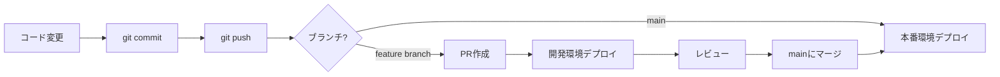

# GitHub Actionsでの自動デプロイ設定（CD）

このプロジェクトでは：
- **CI（テスト/ビルド）**: lefthookで実行
- **CD（デプロイ）**: GitHub Actionsで実行

## 1. Cloudflare APIトークンの取得

### ステップ1: Cloudflareダッシュボードにアクセス

1. https://dash.cloudflare.com にログイン
2. 右上のアカウントアイコンをクリック
3. **"My Profile"** を選択
4. 左メニューから **"API Tokens"** を選択

### ステップ2: APIトークンを作成

1. **"Create Token"** ボタンをクリック
2. **"Edit Cloudflare Workers"** テンプレートの **"Use template"** をクリック
3. 以下の設定を確認：
   - **Permissions:**
     - Account > Cloudflare Workers Scripts > Edit
     - Account > Account Settings > Read
   - **Account Resources:**
     - Include > [あなたのアカウント名]
   - **Zone Resources:**
     - Include > All zones（または特定のゾーン）

4. **"Continue to summary"** をクリック
5. **"Create Token"** をクリック

### ステップ3: トークンをコピー

生成されたAPIトークンが表示されます。**このトークンは一度しか表示されません**ので、必ずコピーしてください。

```
例: y_12345abcdefghijklmnopqrstuvwxyz
```

## 2. GitHub Secretsに登録

### ステップ1: GitHubリポジトリの設定画面へ

1. あなたのGitHubリポジトリを開く
2. **"Settings"** タブをクリック
3. 左メニューから **"Secrets and variables"** > **"Actions"** を選択

### ステップ2: Secretを追加

1. **"New repository secret"** ボタンをクリック
2. 以下の情報を入力：
   - **Name:** `CLOUDFLARE_API_TOKEN`
   - **Secret:** 先ほどコピーしたCloudflare APIトークンを貼り付け
3. **"Add secret"** をクリック

## 3. 自動デプロイの動作確認

### デプロイトリガー

`.github/workflows/deploy.yml` の設定により：

- **mainブランチへのpush時のみ:** 本番環境（`seikin-backend-production`）に自動デプロイ

### ワークフロー

1. ローカルで開発・変更
2. `git commit` 時にlefthookがCI（テスト/ビルド）を実行
3. `git push origin main` で本番環境に自動デプロイ

```bash
git add .
git commit -m "Deploy to production"  # lefthookがCIを実行
git push origin main  # GitHub ActionsがCDを実行
```

## 4. デプロイ状況の確認

### GitHub Actionsのログ確認

1. GitHubリポジトリの **"Actions"** タブを開く
2. 最新のワークフロー実行をクリック
3. **"Deploy"** ジョブをクリックしてログを確認

### デプロイ成功の確認

デプロイが成功すると、以下のURLでアクセスできます：

- **本番環境:** `https://seikin-backend-production.your-subdomain.workers.dev/health`

コマンドラインでテスト：

```bash
curl https://seikin-backend-production.your-subdomain.workers.dev/health
# 出力: OK
```

## 5. トラブルシューティング

### エラー: "Authentication error"

- `CLOUDFLARE_API_TOKEN` が正しく設定されているか確認
- トークンの権限（Permissions）が適切か確認

### エラー: "Build failed"

- ローカルでビルドが成功しているか確認
- lefthookのCIが成功しているか確認
- Cloudflare公式の`wrangler-action`がビルドを処理します

### エラー: "wrangler.toml not found"

- `workingDirectory: 'apiroute'` が正しいか確認
- リポジトリのディレクトリ構造が正しいか確認

### ログの詳細確認

GitHub Actionsのログで以下のステップを確認：

1. ✅ Checkout code
2. ✅ Deploy to Cloudflare Workers（Cloudflare公式アクションが自動でビルド&デプロイ）

## 6. ローカルでのテスト（デプロイ前）

デプロイ前にローカルでテストすることを推奨：

```bash
# Wranglerのインストール
npm install -g wrangler

# ログイン
wrangler login

# ローカルでWorkerを実行
cd apiroute
wrangler dev
```

ブラウザまたはcurlでテスト：

```bash
curl http://localhost:8787/health
# 出力: OK
```

## 7. デプロイフローの例



## 参考リンク

- [Cloudflare Workers Docs](https://developers.cloudflare.com/workers/)
- [Wrangler CLI Docs](https://developers.cloudflare.com/workers/wrangler/)
- [GitHub Actions Docs](https://docs.github.com/en/actions)
